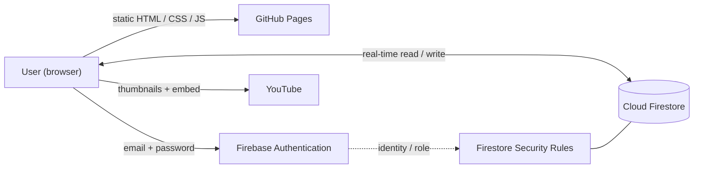

# Video Vault 🎬

A personal video library web app: save favourite YouTube videos, organise them into playlists, and play them from any device. A **zero-build static front-end** on GitHub Pages, backed by **Firebase** (Authentication + Firestore) for real login, cloud storage, and live sync.

**🔗 Live demo:** `https://srikanthchandra174.github.io/video-vault/`


---

## Overview

Video Vault is a private, account-gated collection of YouTube videos. The owner can add, organise, and remove videos; additional accounts can be granted **read-only** access to browse and watch. All data lives in Firestore and syncs in real time across every signed-in device.

## Key Features

- 🔐 **Real authentication** — Firebase email/password login (server-enforced, not a cosmetic gate).
- 👮 **Role-based access control** — a single owner account has full create/update/delete rights; **all other accounts are read-only viewers**, enforced both in the UI *and* in Firestore security rules.
- 🗂️ **Playlists** — create, delete, and assign videos to playlists; filter the library by playlist.
- ⚡ **Live cloud sync** — changes propagate instantly across devices via Firestore real-time listeners (`onSnapshot`).
- 🖼️ **Automatic thumbnails & titles** — pulled from a YouTube video URL (multi-resolution thumbnail fallback + oEmbed titles), no API key required.
- ▶️ **In-app player** — embedded playback with a "Watch on YouTube" fallback.
- 💾 **Backup & import** — export/import the collection as JSON.

## Architecture



The front-end is a single static `index.html` (ES-module JavaScript) served by GitHub Pages. It talks directly to Firebase from the browser — there is no custom backend server to maintain.

## Tech Stack

- **HTML5, CSS3, JavaScript (ES modules)** — no framework, no build step.
- **Firebase Authentication** — email/password sign-in.
- **Cloud Firestore** — NoSQL document store with real-time listeners.
- **Firestore Security Rules** — authorization layer (read for any signed-in user, write restricted to the owner).
- **YouTube** — thumbnail endpoints + oEmbed + embedded player.
- **GitHub Pages** — hosting & deploy.

## Security Model

Authorization is enforced at the data layer, not just the UI:

```
rules_version = '2';
service cloud.firestore {
  match /databases/{database}/documents {
    match /vault/{document=**} {
      allow read:  if request.auth != null;
      allow write: if request.auth != null
                   && request.auth.token.email == "OWNER_EMAIL_HERE";
    }
  }
}
```

Any signed-in account can **read** the shared vault; only the owner's account can **write**. The UI hides edit controls for viewers, but even a viewer who bypasses the UI cannot modify data — the rules reject the write server-side.

> **Note on the Firebase config:** the `firebaseConfig` keys committed in this repo are **not secrets** — they are safe to expose publicly. Firebase security is enforced by Authentication + the Firestore rules above, not by hiding these identifiers. No passwords or private credentials are stored in this repository.

## Data Model

| Path | Fields |
|------|--------|
| `vault/main/videos/{id}` | `videoId`, `url`, `title`, `playlistId`, `createdAt` |
| `vault/main/playlists/{id}` | `name`, `createdAt` |

## Setup

Full step-by-step setup (create the Firebase project, enable Firestore & Auth, publish rules, deploy) is in **[SETUP.md](SETUP.md)**.

## Run Locally

```bash
git clone https://github.com/<your-username>/video-vault.git
cd video-vault
# open index.html in a browser
```
> Authentication and embedded playback are most reliable on the deployed HTTPS URL; some features are restricted under the `file://` origin.

## Engineering Highlights

- Designed a **role-based authorization** scheme enforced through Firestore security rules rather than client-side checks alone.
- Implemented **real-time data sync** with Firestore listeners for an instant multi-device experience.
- Integrated YouTube without an API key via thumbnail endpoints and oEmbed, with a **graceful multi-resolution fallback**.
- Kept the entire app a **dependency-free, build-free single file** for trivial deployment.

## Roadmap

- Drag-and-drop playlist reordering.
- Tags / search across playlists.
- Optional per-viewer accounts with granular permissions.

## License

Released under the [MIT License](LICENSE).
